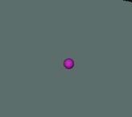

# ROS2 A* Path Planner Simulation

This project demonstrates the use of a ROS2-based A* path planner for simulating autonomous robot navigation in RViz. The planner utilizes ROS2 to launch a robot description and an A* path planning node.

## Prerequisites

Ensure that ROS2 (e.g., ROS2 Humble) is installed on your system. Follow the official [ROS2 installation guide](https://docs.ros.org/en/foxy/Installation.html) for detailed instructions.

## Getting Started

Follow these steps to set up and launch the simulation:

### Step 1: Prepare the Workspace

1. Clone all necessary repositories and place them in the `ros2_ws/src` directory.

    Navigate to directory by using the command below

    ```bash
    cd ros2_ws/src
    ```

    Either clone the git using https key or download it as a zip file 

    

    and extract into the navigated directory.


2. In the terminal navigate to your ros2_ws:

    ```bash
    cd ..
    ```
    to go back to the ros2_ws folder

3. Build the workspace with `colcon`:

    ```bash
    colcon build --symlink-install
    ```

4. Source your ROS2 environment:

    ```bash
    source install/setup.bash
    ```

### Step 2: Launch the Robot Description

Start by launching the robot description in RViz:

```bash
ros2 launch innok_description display.launch.py gui:=False
```

### Step 3: Configure RViz for Visualization

Configuration can be done either by loading an already made config in this case named "mainconfig" or configuring it following the steps below.


Press Discard


if you have used mainconfig, go to step 4. but if you want to Ensure RViz is correctly set up follow these guidelines:


1. If the "Fixed Frame" is not set to `base_link`, change it to 
`base_link`.

- **RViz Visualization Example:**  
  

2. Configure the following components and topics in RViz:

By using the `add` functionality you can add the follwoing componenets:

 

 


   - **Component: Map**  
     - Topic: `grid_map`  

   - **Component: Marker Array**  
     - Topic: `Obstacle marker`

      

   - **Component: Path**  
     - Topic: `plan path`

   - **Component: Point Stamped**  
     - Topic: `clicked point`

Refer to the example image below to visualize the correct settings:

- **Final Component Configuration Overview:**  
  


### Step 4: Launch the A* Path Planner
launch another Terminal
   
Source
```bash
source install/setup.bash
```
    
Launch the A* path planner node to start the simulation:

```bash
ros2 launch a_star a_star_planner.launch.py
```


### Step 5: Creating points for path planning

You can find the publish point on the top bar of the Rviz toolbox.


Press on the created grid to create the point.



**Under PointStampted, You can change the radius of the ball to become more visible.**

Create another point on the grid map following the same steps used for the first point.


A path will be created between the created 2 points. 


## Conclusion

By following the steps above, you should have a running simulation of a robot in RViz using the A* path planning algorithm. You can adjust the RViz settings as needed to match your specific requirements or to better visualize the robot's environment and planned path.


## Contact

For questions, suggestions, or support, please contact [Your Name](mailto:your.email@example.com).
